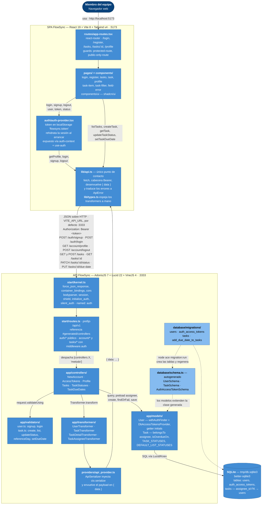

# Arquitectura de FlowSync

Este es un diagrama de contenedores (C4 nivel 2) del sistema tal y como está hoy en el
repositorio: una SPA de React que se sirve por Vite, una API HTTP de AdonisJS y un fichero
SQLite. Dentro de cada contenedor se dibujan solo las piezas que existen como ficheros y el
camino real que recorre una petición: del enrutado del navegador a `lib/api.ts`, de ahí al
stack de middleware de la API, a los controladores, sus validadores de VineJS, los modelos
de Lucid y los transformers que envuelven toda respuesta en `{ data }`. Las flechas
discontinuas son relaciones de tiempo de build, no de ejecución: las migraciones generan
`database/schema.ts`, del que heredan los modelos. Todo lo dibujado sale de leer el código;
lo que no se ha podido verificar en un fichero no aparece.

**Qué no está dibujado, y por qué:** el guard `web` de sesión existe en `config/auth.ts` pero
ninguna ruta lo usa; el registro Tuyau de `.adonisjs/client/registry/` solo lo consume
`tests/bootstrap.ts` para tipar el cliente de Japa — el frontend no lo importa, sus tipos
en `lib/types.ts` están escritos a mano. No hay caché, ni cola, ni servicios externos.
